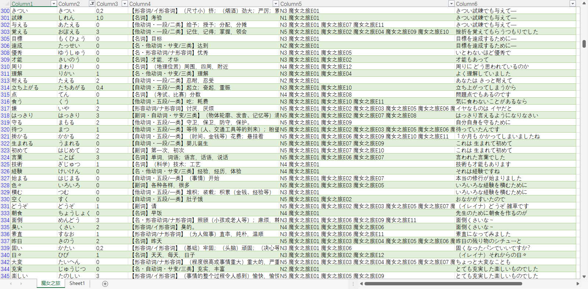
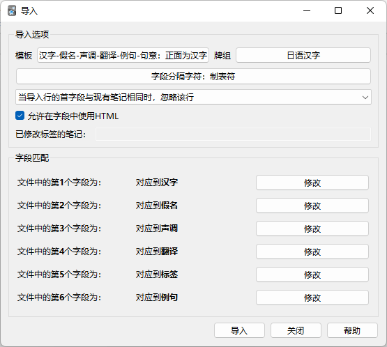

# Anime Anki

把字幕转换成 Anki 卡片，从而快乐背单词的工具。

~~不会真的有人看动漫学日语吧~~

## 下载
- [点兔第三季](https://github.com/flaribbit/anime-anki/releases/download/v0.1/Gochuumon.wa.Usagi.Desuka.S03.txt)
- [魔女之旅](https://github.com/flaribbit/anime-anki/releases/download/v0.1/Wandering.Witch_The.Journey.of.Elaina.txt)
- pending

## 数据格式
txt 包含 6 列数据，分别对应：汉字，假名，声调，翻译，标签，原句

标签包含 JLPT 等级和在动漫中出现的集数，以方便筛选

如果有其它更好的想法，欢迎在 issue 中提出

能贡献代码就更好了（）

## 如何使用
[Anki 桌面版](https://apps.ankiweb.net/#dlarea)，文件-导入，选择对应字段即可

## 感谢
- [kitsunekko](https://www.kitsunekko.net/)
- [itazuraneko](https://itazuraneko.neocities.org/library/sub.html)
- [喵萌奶茶屋](https://github.com/Nekomoekissaten-SUB/)
- 桜都字幕组
- 和其他所有公益字幕组
